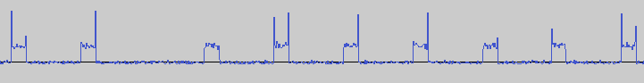

Hacky implementation for the protocol of a random temperature/humidity sensor.
Written in Lua because I originally wanted to try out [LuaRadio](http://luaradio.io/), but using the `rtl_fm` tool was much easier because the protocol is so simple.

# Usage

`rtl_fm -M am -f 433.92M -s 30k -g 50 | luajit decode.lua`

Plain Lua also works but uses 5 times more CPU because the code is really inefficient.
CPU usage on a Raspberry Pi 3 Model B+ is about 15-20% with LuaJIT. This can probably be reduced.

# Features

* Supports Digoo DG-R8S sensors
* Supports 4 channels simultaneously to monitor multiple sensors
* Outputs temperature and humidity in a format compatible with the collectd exec plugin
* Uses a fancy [repetition code](https://en.wikipedia.org/wiki/Repetition_code) to detect and correct errors
* Lots of hard-coded undocumented constants and magic values in the implementation

# Protocol

This is specific to Digoo DG-RS8 sensors, but other cheap sensors are likely very similar.

## Physical layer

Physical layer uses on-off keying, i.e., passing it through the AM demodulator in `rtl_fm` produces this:



Data is encoded in the time between the pulses:

* Short gap (3 times the length of the pulse): 1
* Long gap (6 times the length of the pulse): 0
* Pulse length is ~533 µs

This means the byte in the image above decodes to `0b10111111` = `0xBF`

## Data link layer

A frame looks like this (each character is a bit):

```
PPPP UUUUUUUUUU CC TTTT TTTTTTTT HHHHHHHH RR
```

* `PPPP` is a preamble, always set to `1001`
* `UUUUUUUUUU` are 10 bits of unknown data that seem to change randomly (No, it's not a checksum)
* `CC` is the channel set on the transmitter `00` to `10` for channels 1 to 3
* `T` and `H` are the data of the next higher layer: temperature and humidity values
* `RR` marks retransmissions: each frame is repeated 5 times, the first one ends with `11` the others with `01`

## Application layer

* First nibble and the next byte are the temperature in °C/10 (big endian)
* The last byte is the relative humidity in percent

